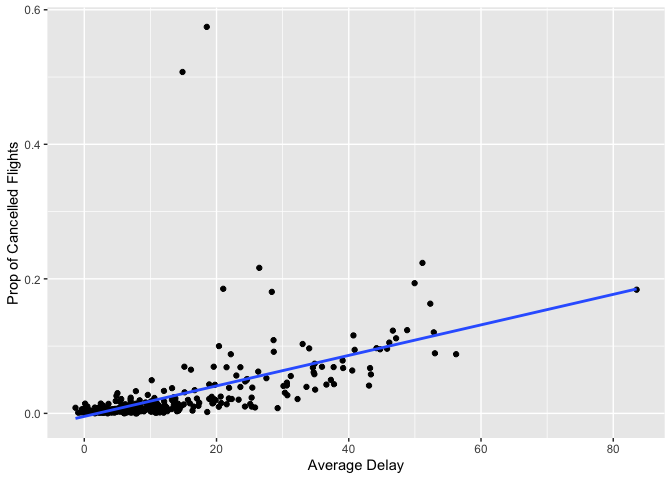

Homework1
================
Sirui Chu
2022-09-26

``` r
library(dplyr)
```

    ## 
    ## Attaching package: 'dplyr'

    ## The following objects are masked from 'package:stats':
    ## 
    ##     filter, lag

    ## The following objects are masked from 'package:base':
    ## 
    ##     intersect, setdiff, setequal, union

``` r
library(ggplot2)
library(nycflights13)
```

#### Q1: How many flights have a missing `dep_time`? What other variables are missing? What might these rows represent?

``` r
sum(is.na(flights$dep_time))
```

    ## [1] 8255

**Answer:** There are 8255 flights have a missing `dep_time`.

``` r
filter(flights, is.na(dep_time))
```

    ## # A tibble: 8,255 × 19
    ##     year month   day dep_time sched_dep_time dep_delay arr_time sched_arr_time
    ##    <int> <int> <int>    <int>          <int>     <dbl>    <int>          <int>
    ##  1  2013     1     1       NA           1630        NA       NA           1815
    ##  2  2013     1     1       NA           1935        NA       NA           2240
    ##  3  2013     1     1       NA           1500        NA       NA           1825
    ##  4  2013     1     1       NA            600        NA       NA            901
    ##  5  2013     1     2       NA           1540        NA       NA           1747
    ##  6  2013     1     2       NA           1620        NA       NA           1746
    ##  7  2013     1     2       NA           1355        NA       NA           1459
    ##  8  2013     1     2       NA           1420        NA       NA           1644
    ##  9  2013     1     2       NA           1321        NA       NA           1536
    ## 10  2013     1     2       NA           1545        NA       NA           1910
    ## # … with 8,245 more rows, and 11 more variables: arr_delay <dbl>,
    ## #   carrier <chr>, flight <int>, tailnum <chr>, origin <chr>, dest <chr>,
    ## #   air_time <dbl>, distance <dbl>, hour <dbl>, minute <dbl>, time_hour <dttm>

**Answer:** `dep_delay`, `arr_time`, `arr_delay`, `air_time` are also
missing. Flights with these variables missing might be cancelled.

#### Q2: Currently `dep_time` and `sched_dep_time` are convenient to look at, but hard to compute with because they’re not really continuous numbers. Convert them to a more convenient representation of number of minutes since midnight.

``` r
flights_new = flights %>%
  mutate(dep_time_new = (dep_time %% 100) + 60 * (dep_time %/% 100),
         sched_dep_time_new = (sched_dep_time %% 100) + 60 * (sched_dep_time %/% 100))

select(flights_new, starts_with('dep_time'), starts_with('sched_dep'))
```

    ## # A tibble: 336,776 × 4
    ##    dep_time dep_time_new sched_dep_time sched_dep_time_new
    ##       <int>        <dbl>          <int>              <dbl>
    ##  1      517          317            515                315
    ##  2      533          333            529                329
    ##  3      542          342            540                340
    ##  4      544          344            545                345
    ##  5      554          354            600                360
    ##  6      554          354            558                358
    ##  7      555          355            600                360
    ##  8      557          357            600                360
    ##  9      557          357            600                360
    ## 10      558          358            600                360
    ## # … with 336,766 more rows

#### Q3: Look at the number of canceled flights per day. Is there a pattern? Is the proportion of canceled flights related to the average delay? Use multiple dyplr operations, all on one line, concluding with `ggplot(aes(x= ,y=)) + geom_point()`.

``` r
flights %>% 
  group_by(month, day) %>%
  summarize(avg_dep_delay = mean(dep_delay, na.rm = T),
            prop_cancelled = sum(is.na(dep_time)/n())) %>%
  ggplot(aes(x = avg_dep_delay, y = prop_cancelled)) +
  labs(x = "Average Delay", y = "Prop of Cancelled Flights") +
  geom_point() +
  geom_smooth(method = 'lm', se = F)
```

    ## `summarise()` has grouped output by 'month'. You can override using the
    ## `.groups` argument.
    ## `geom_smooth()` using formula 'y ~ x'

<!-- -->

**Answer:** From the plot, we can see that there exists a pattern. It’s
seemed to have a positive linear trend between the proportion of
cancelled flights and the average delay.
